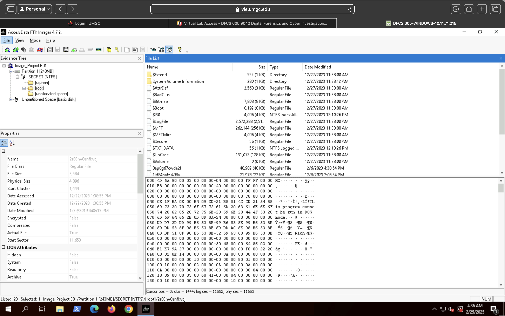
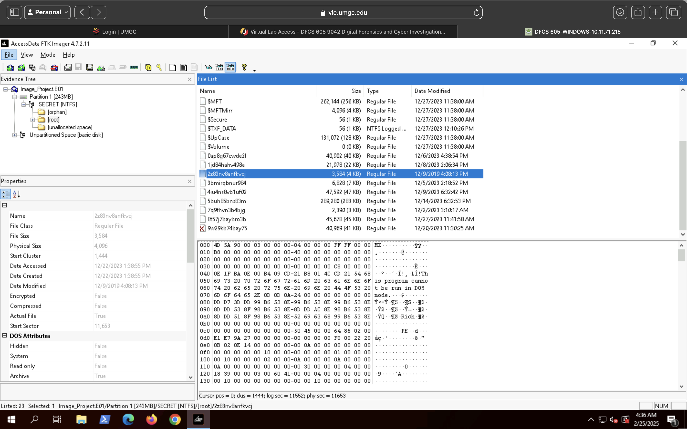
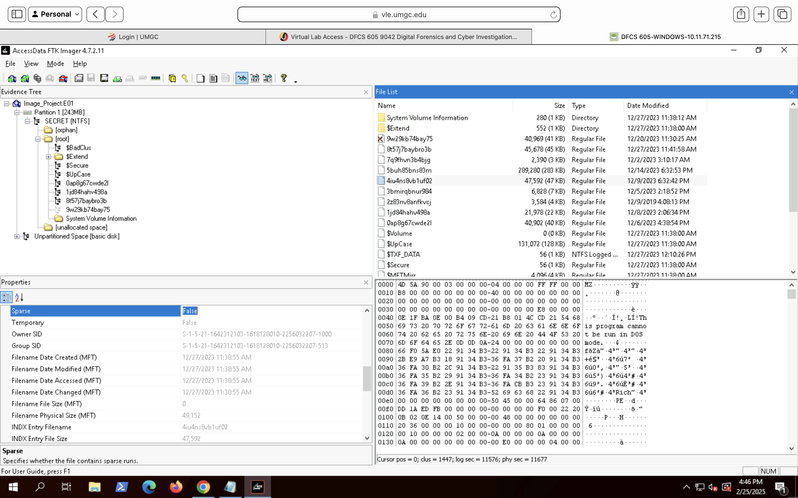
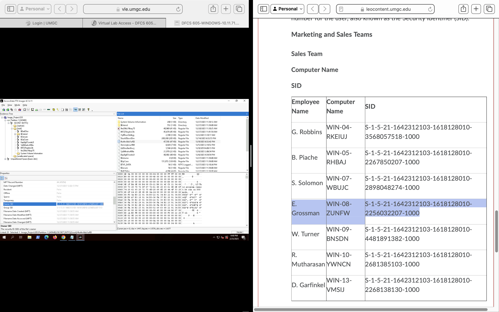

# Forensic Analysis

This analysis focuses on identifying evidence of user interaction, file execution, and artifact consistency within the examined NTFS file system.

## File System Overview
The disk image was examined to identify the NTFS file system structure, including directories, user files, and system-generated artifacts.

## Registry Artifact Analysis – Recent File Execution
Windows Registry artifacts were examined to identify evidence of user interaction with recovered files. The `Recent File List` key associated with the WordPad application was reviewed to determine whether examined documents had been actively opened by the user.

The registry entry confirmed that the file `Rolley.rtf` was accessed through WordPad, indicating intentional user interaction rather than passive file presence. This artifact supports file execution and user activity correlation within the examination timeframe. While registry artifacts alone do not confirm malicious activity, they provide strong supporting evidence of intentional user interaction with the file.

### Supporting Evidence – WordPad Recent File Registry Entry

The following screenshot shows the Windows Registry location documenting recently accessed files within WordPad. The presence of `Rolley.rtf` confirms application-level interaction with the file.

 ### User File Artifact Examination
During file system analysis, user-created documents were reviewed to identify artifacts of forensic relevance. The file `Devin.rtf` was identified within a user directory and examined using FTK Imager.

The artifact contained user-generated content and displayed valid NTFS metadata, including created, modified, and accessed timestamps. File attributes and size information were consistent with a legitimate document created through normal user activity.

#### Supporting Evidence – User File Metadata and Content (FTK Imager)

### User Artifact Correlation and Timeline Consistency

Further examination of the user directory revealed multiple user-created Rich Text Format (RTF) files, including `Devin.rtf` and `Rolley.rtf`. These artifacts were located within the same directory and exhibited closely aligned creation and modification timestamps. Collectively, these findings indicate normal user-generated document activity rather than automated, malicious, or anomalous file creation.
The proximity of timestamps and consistent NTFS metadata attributes suggest normal user activity rather than automated or malicious file creation. This correlation supports the conclusion that the files were generated during routine system use by the same user account.

#### Supporting Evidence – Multiple User File Correlation (FTK Imager)

## NTFS File System Structure Analysis

### Supporting Evidence – NTFS Metadata and System Files

## Suspicious Executable Identification (NTFS Root Directory)

During file system analysis of the NTFS partition labeled `SECRET`, multiple files with non-descriptive, randomized filenames were identified. One file, `2z83nv8anfkvcj`, was examined in detail due to its unusual naming convention and location within the root directory.

Hex-level analysis revealed the presence of the `MZ` file signature, confirming the file is a Windows Portable Executable (PE). The executable header was visible despite the absence of a standard `.exe` extension, indicating deliberate obfuscation of file type.

File metadata showed the file was accessed during the examination timeframe and contained valid NTFS attributes, suggesting the file was present and accessible on the system rather than residual or corrupted data.

### Supporting Evidence – Disguised Executable with PE Header (FTK Imager)

### NTFS Metadata and Low-Level File Examination

Further analysis was conducted on files with non-descriptive, system-generated names within the NTFS partition. The file `4iu4ns8vb1u02` was examined at the metadata and hex level using FTK Imager.

NTFS metadata revealed consistent MFT timestamps for creation, modification, access, and entry change, indicating legitimate file system activity rather than artifact corruption. The file was not marked as sparse or temporary, and valid owner and group SIDs were present.

Hex-level inspection revealed a valid executable header, confirming that the file contains structured binary data rather than random or unallocated content. This analysis supports the conclusion that the file represents a legitimate stored artifact within the file system.

### NTFS Owner SID Attribution and User Correlation

NTFS file ownership metadata was examined to determine the user account associated with files stored within the SECRET partition. The Owner SID extracted from the file system metadata was analyzed using FTK Imager.

The identified SID was correlated with documented user-to-system mappings provided in the case reference material. This correlation confirmed that the file was owned by the user account associated with E. Grossman, mapped to workstation WIN-08-ZUNFW.

This attribution links the file artifact to a specific user identity and system, strengthening conclusions regarding user activity and file ownership within the examined environment.

Forensic image integrity was validated prior to analysis using MD5 and SHA1 hash verification within FTK Imager.

Cryptographic hash values for identified files were independently validated using exported CSV data to confirm file integrity.
