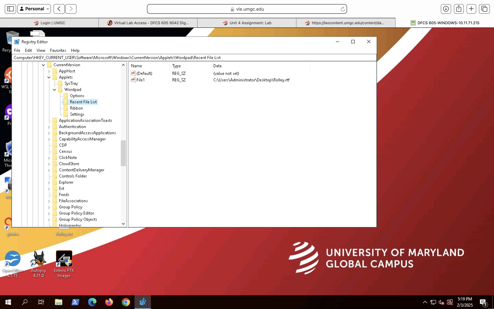
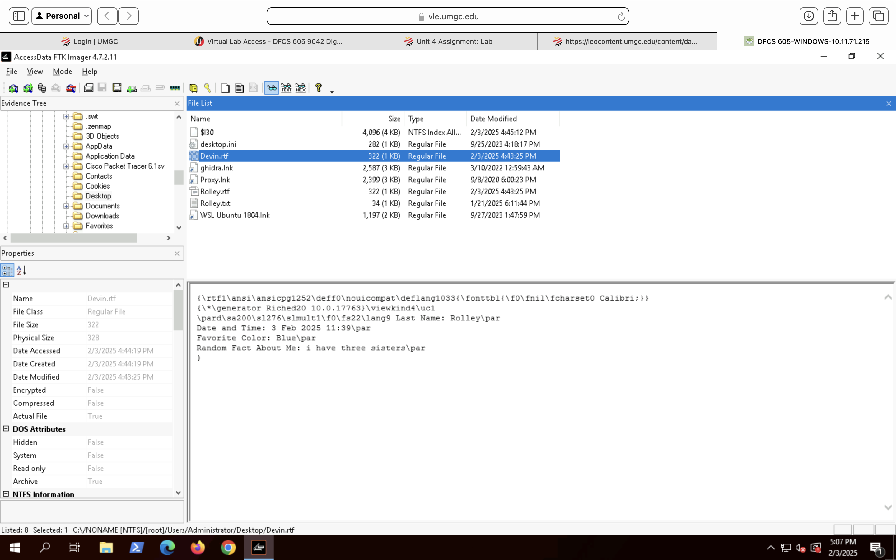
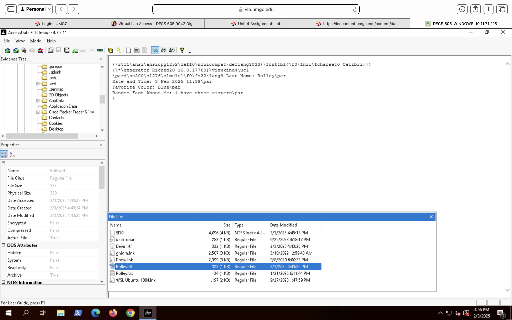

# Forensic Analysis

This analysis focuses on identifying evidence of user interaction, file execution, and artifact consistency within the examined NTFS file system.

## File System Overview
The disk image was examined to identify the NTFS file system structure, including directories, user files, and system-generated artifacts.

## Registry Artifact Analysis – Recent File Execution
Windows Registry artifacts were examined to identify evidence of user interaction with recovered files. The `Recent File List` key associated with the WordPad application was reviewed to determine whether examined documents had been actively opened by the user.

The registry entry confirmed that the file `Rolley.rtf` was accessed through WordPad, indicating intentional user interaction rather than passive file presence. This artifact supports file execution and user activity correlation within the examination timeframe. While registry artifacts alone do not confirm malicious activity, they provide strong supporting evidence of intentional user interaction with the file.

### Supporting Evidence – WordPad Recent File Registry Entry

The following screenshot shows the Windows Registry location documenting recently accessed files within WordPad. The presence of `Rolley.rtf` confirms application-level interaction with the file.

 ### User File Artifact Examination
During file system analysis, user-created documents were reviewed to identify artifacts of forensic relevance. The file `Devin.rtf` was identified within a user directory and examined using FTK Imager.

The artifact contained user-generated content and displayed valid NTFS metadata, including created, modified, and accessed timestamps. File attributes and size information were consistent with a legitimate document created through normal user activity.

#### Supporting Evidence – User File Metadata and Content (FTK Imager)

### User Artifact Correlation and Timeline Consistency

Further examination of the user directory revealed multiple user-created Rich Text Format (RTF) files, including `Devin.rtf` and `Rolley.rtf`. These artifacts were located within the same directory and exhibited closely aligned creation and modification timestamps. Collectively, these findings indicate normal user-generated document activity rather than automated, malicious, or anomalous file creation.
The proximity of timestamps and consistent NTFS metadata attributes suggest normal user activity rather than automated or malicious file creation. This correlation supports the conclusion that the files were generated during routine system use by the same user account.

#### Supporting Evidence – Multiple User File Correlation (FTK Imager)

