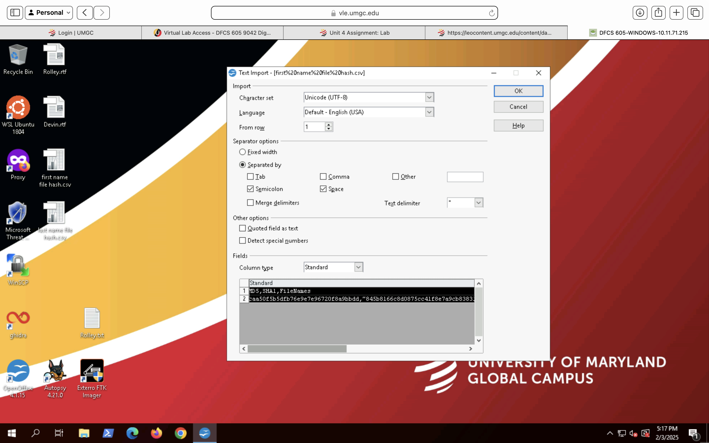
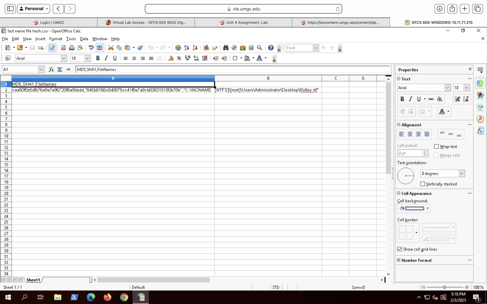

# Evidence Description

The evidence examined consisted of a disk image containing an NTFS file system. Analysis was conducted using FTK Imager in a controlled forensic environment to preserve data integrity and prevent evidence contamination.

## Evidence Sources

| Source         | Description                                              |
|----------------|----------------------------------------------------------|
| Disk Image     | NTFS file system image analyzed using FTK Imager          |
| File Artifacts | User-created files and directories                       |
| Metadata       | NTFS timestamps and file attribute information            |

## Data Collection Methodology
FTK Imager was used to mount and examine the disk image in a read-only state. No modifications were made to the original evidence. All findings were documented contemporaneously.

## Cryptographic Hash Verification

Cryptographic hash verification was performed to ensure evidentiary integrity and to support independent validation of analysis results.

### Supporting Evidence – Hash File Import Validation

The following screenshot documents the import of the hash output CSV file into a spreadsheet application. Import settings, character encoding, and delimiters were reviewed to ensure accurate parsing of cryptographic hash values and file paths prior to analysis.

This step helps prevent data corruption or misinterpretation when validating file integrity outside the forensic tool.

To preserve evidentiary integrity and support independent validation, cryptographic hash values were generated for selected user-created files. Hash values were exported and documented outside of the forensic tool to demonstrate reproducibility and integrity verification.

The following screenshot shows MD5 and SHA-1 hash values recorded alongside the full NTFS file path, enabling verification that the file contents remained unchanged during analysis.

### Supporting Evidence – File Hash Verification (MD5 / SHA-1)

## Integrity Considerations
Evidence integrity was maintained by ensuring read-only access, documenting timestamps, and avoiding unnecessary system interaction during analysis.
